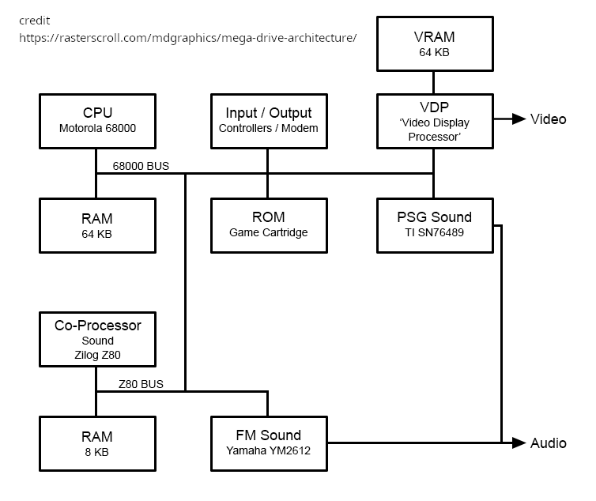
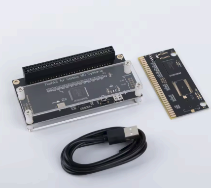

# A Tour of Sega Genesis Development Tools

### Shawn Chivers

---

## About this talk

- Directional, not a full tutorial
- **Sega Genesis** is a video game console that was sold in North America
- Examples come from a small demo project built for this talk
- No one endorses my statements

---

## Starting with the end in mind

- A working Genesis game needs:
    - art: sprites, backgrounds, tiles
    - sound: effects, music
    - input handling: gamepad, light gun
    - game logic

---


## Cow Abductors Game

- Small game built for this presentation [here](https://github.com/shawnchivers/cow-abuction)
- Useful because it touches the whole pipeline:
    - drawing art
    - converting assets
    - compiling code
    - debugging on hardware or emulators

---


## Genesis Architecture - Detour

- **Motorola 68000** is the main CPU and runs most game code
- **Zilog Z80** is usually used for audio support and sound driver work
- The **VDP** handles tiles, planes, sprites, scrolling, and access to VRAM
- Audio is built from the Yamaha YM2612 FM chip plus the TI SN76489 PSG
- The practical result: code, graphics, and sound are separate jobs that must share tight hardware limits

---

<!-- _class: arch-diagram -->


---

## Genesis Architecture: VDP

- **Video Display Processor** - 320x224 or 256x224 resolution (NTSC)
- **80 sprites on screen** - limit 20 per scanline
- **64 KB VRAM** - Video RAM
- **128 bytes CRAM** - 4 palette x 16 colors (512 color space)
- **DMA** - fast VRAM fills, copies, and 64K->VRAM transfers

---

## SGDK

- [SGDK](https://github.com/Stephane-D/SGDK) license: MIT
- [rescomp](https://github.com/Stephane-D/SGDK/blob/master/bin/rescomp.txt) license: MIT
- SGDK toolkit for Sega Genesis / Mega Drive development
- `rescomp` converts images, maps, palettes, and audio into ROM resources

---

## What SGDK Gives You

- Writing **Sega Genesis** games in C!
- VDP helpers for tiles, backgrounds, text, scrolling, and palette loading
- Sprite engine for animated objects and VRAM management
- Input APIs for pads and other controller hardware
- Audio APIs that work with PCM samples and [XGM music](https://github.com/Stephane-D/SGDK/blob/master/bin/rescomp.txt)

---

## The `.res` File

- [rescomp](https://github.com/Stephane-D/SGDK/blob/master/bin/rescomp.txt) license: MIT
- A `.res` file is the manifest for your game assets
- It tells `rescomp` what to convert and what C symbol names to generate
- Typical resource types: `SPRITE`, `IMAGE`, `MAP`, `TILESET`, `PALETTE`, `WAV`, `XGM`, `BIN`

---

## Sample `.res` File

```text
IMAGE bgrect "back.png" BEST ALL
PALETTE bgrect_pal "back.png"

SPRITE cow "cow.png" 4 8 BEST
SPRITE cow2x "cow2x.png" 6 10 BEST
SPRITE ret "ret.png" 4 4 BEST
SPRITE ufo "ufo.png" 8 4 BEST
SPRITE exp "exp.png" 8 4 BEST

PALETTE cow_pal "cow.png"
PALETTE ufo_pal "ufo.png"

BIN gameon "gameon.xgc" 256
WAV gunshot_sfx "gunshot.wav" XGM
WAV hitgun_mix_sfx "hitgun_mix.wav" XGM
```

---

## Ultimate purpose of `.res` File

- It keeps art, maps, and sound in one build step instead of hand-converting files
- It lets code refer to generated symbols instead of raw files
- It becomes the contract between tools and code:
    - artists export PNG, TMX, WAV, or VGM
    - `rescomp` builds C-friendly resources
    - game code loads and plays them

---

## Build: SGDK in Action

- `SPR_addSprite()` - loading ufo & cow sprites in VDP
- `JOY_readJoypad()` - reading player input each frame
- `XGM_startPlay()` - triggering music and SFX
- `SYS_doVBlankProcess()` - syncing everything 

---

## Just a Cow

- Example time of just a cow.

---

## Cow RES File

```text
SPRITE cow "cow.png" 8 8 NONE 0
PALETTE cow_pal "cow.png"
```

---

## Cow C Code

```c
#include <genesis.h>
#include "resources.h"

int main(bool hard)
{
  (void) hard;

  VDP_setScreenWidth256();
  SPR_init();
  PAL_setPalette(PAL1, cow_pal.data, CPU);

  Sprite *cowSprite = SPR_addSprite(&cow, 104, 72,
    TILE_ATTR(PAL1, FALSE, FALSE, FALSE));

  SPR_setVisibility(cowSprite, VISIBLE);

  // main loop
  while (TRUE) {

    if (JOY_readJoypad(JOY_1) & BUTTON_A) {}
      VDP_drawText("Mu", 10, 10);
    } else {
      VDP_clearText(10, 10, 10);
    }

    SPR_update();
    SYS_doVBlankProcess();
  }
]
```

---

## Marsdev

- [Marsdev](https://github.com/andwn/marsdev) license: MIT
- Cross-platform toolchain for **Sega Genesis** and 32X work
- Good option on Linux

---

## Reproducible Builds

- [Docker Engine](https://docs.docker.com/engine/install/) license: Apache 2.0
- Containers make the build environment repeatable across machines
- Helpful when you want to avoid local toolchain drift
- [My Docker](https://github.com/shawnchivers/schiv-genesis-docker-build)

---

## Debugging Example

- Typical loop:
    - build the ROM
    - run it
    - step thru code
    - find the broken sprite, sound, or logic
    - fix the asset or code and rebuild quickly

---

## Run & Debug: BlastEm

- Loading `rom` - instant feedback loop
- GDB stub for stepping through logic
- Test on cycle-accurate emulation before real hardware

---

## Pixel Art

- [LibreSprite](https://libresprite.github.io/) license: GPLv2
- Excellent fit for sprites, tiles, and palette-limited pixel art
- Fast iteration for character animation and background work

---

## Art - Other Tools

- [GIMP](https://www.gimp.org/downloads/) license: GNU GPL
- [Blender](https://www.blender.org/download/) license: GNU GPL v2 or later
- GIMP is useful for cleanup, color reduction, and sprite sheet prep
- Blender is useful for pre-rendered sprites, references, or promo art

---

## Sound Effects

- [Audacity](https://www.audacityteam.org/download/) license: GPLv3
- [rescomp](https://github.com/Stephane-D/SGDK/blob/master/bin/rescomp.txt) license: MIT
- Audacity is a practical way to trim and export WAV files
- `rescomp` turns those assets into something SGDK can build into the ROM

---

## Music Tracker

- [Furnace](https://github.com/tildearrow/furnace/releases) license: GPLv2 or later
- Multi-system tracker with strong Sega Genesis / YM2612 support
- Good choice for music when you want more control than one-shot samples

---

## Writing to Everdrive

- Build the ROM (`.bin`) from your SGDK project
- Copy the ROM to an SD card used by your flash cartridge
- Insert the flash cartridge into real Genesis / Mega Drive hardware
- Boot and test for timing, input feel, audio balance, and visual artifacts
- Repeat quickly: tweak code or assets, rebuild, and re-test on hardware
- Krikzz version are correctly beveled

---

<!-- _class: split-two -->
## MD Rewriter - Krikzz

<div class="columns">
<div>

- [FlashKit](https://github.com/krikzz/flashkit/)
- [Flash Cartridge](https://krikzz.com/our-products/cartridges/flashkitmd.html)
- [Flasher](https://krikzz.com/our-products/accessories/flashkitmd.html)
- Krikzz version recommended - AliExpress version exist that support saves on cart

</div>
<div>



</div>
</div>

---


<!-- _class: software-overview -->
## Software Overview

<div class="overview-columns">
<div>

### Core dev
- [SGDK](https://github.com/Stephane-D/SGDK) - MIT
- [rescomp](https://github.com/Stephane-D/SGDK/blob/master/bin/rescomp.txt) - MIT
- [GCC](https://gcc.gnu.org/) - GPLv3
- [Marsdev](https://github.com/andwn/marsdev) - MIT
- [Docker Engine](https://docs.docker.com/engine/install/) - Apache 2.0
- [My Docker](https://github.com/shawnchivers/schiv-genesis-docker-build) - MIT
- [VSCodium](https://vscodium.com/) - MIT

&nbsp;
### Debug and test
- [GDB](https://www.sourceware.org/gdb/) - GPLv3
- [BlastEm](https://github.com/libretro/blastem) - GPL-3.0+
- [FlashKit software](https://github.com/krikzz/flashkit/) - MIT

</div>
<div>

### Content tools
- [LibreSprite](https://libresprite.github.io/) - GPLv2
- [GIMP](https://www.gimp.org/downloads/) - GNU GPL
- [Blender](https://www.blender.org/download/) - GNU GPL v2+
- [Audacity](https://www.audacityteam.org/download/) - GPLv3
- [Furnace](https://github.com/tildearrow/furnace/releases) - GPLv2+

</div>
</div>

---